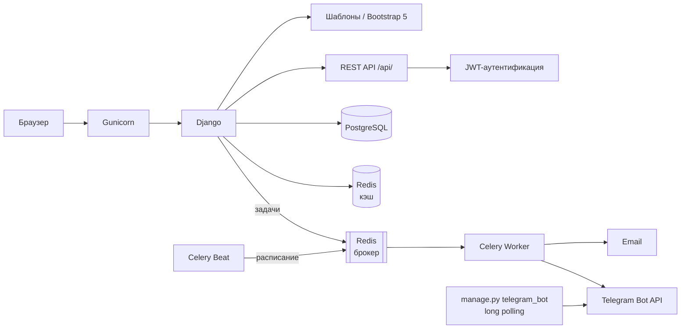

# DiaMed — сайт медицинского диагностического центра

[](https://github.com/An2rei-84/DiaMed/actions/workflows/ci.yml)


Полнофункциональный веб-сайт медицинского диагностического центра: каталог услуг, запись на приём
с проверкой свободных слотов и защитой от двойной брони на уровне БД, личный кабинет пациента
с результатами диагностики, REST API с JWT-аутентификацией и асинхронные уведомления
(Email + Telegram) на Celery. Проект покрыт тремя слоями автотестов: unit/integration (pytest),
API black-box (requests) и E2E (Playwright) с Allure-отчётами в CI.

## Возможности

- 🏥 **Каталог услуг** — категории, цены, длительность, подготовка к процедурам
- 📅 **Запись на приём** — через сайт и REST API: проверка занятости слотов (8:00–20:00, шаг 30 мин),
  защита от двойной записи частичным `UniqueConstraint` на уровне БД
- 👤 **Личный кабинет** — записи, статусы, результаты диагностики
- 🔌 **REST API** — DRF + JWT, фильтры, поиск, пагинация, rate limiting
- 📚 **Документация API** — Swagger UI и ReDoc по OpenAPI-схеме (drf-spectacular)
- ✉️ **Уведомления** — письмо-подтверждение при записи и напоминания за день (Celery + Celery Beat);
  для привязанных пользователей — дублирование в **Telegram**
- 💬 **Telegram-бот** — привязка аккаунта по персональному коду (`/start <код>`) через long polling
- ⚡ **Кэширование** — Redis для списка услуг
- 🔐 **Админ-панель** — управление услугами, записями, результатами и контентом
- ✅ **Три слоя автотестов** — 166 unit/integration (покрытие 99%), 35 API black-box, 15 E2E;
  фаззинг OpenAPI-схемы (Schemathesis); Allure-отчёты в CI/CD

## Стек

| Слой | Технологии |
|------|-----------|
| Backend | Python 3.11, Django 4.2 LTS, Django REST Framework, SimpleJWT, django-filter |
| API-документация | drf-spectacular (OpenAPI 3, Swagger UI, ReDoc) |
| Асинхронность | Celery 5, Celery Beat, Redis 7 (брокер и кэш) |
| База данных | PostgreSQL 15 (SQLite для локальной разработки) |
| Инфраструктура | Docker, Docker Compose, Gunicorn, WhiteNoise |
| Тесты: unit/integration | pytest, pytest-django, pytest-cov, factory-boy |
| Тесты: API black-box | requests, Schemathesis (фаззинг OpenAPI) |
| Тесты: E2E | Playwright (Chromium), Page Object Model |
| Отчётность | Allure, pytest-cov |
| Качество | flake8, black, isort, pre-commit |
| CI/CD | GitHub Actions (линтинг → тесты → API black-box → E2E → сборка → деплой) |

## Архитектура



## Быстрый старт (Docker)

```bash
git clone https://github.com/An2rei-84/DiaMed.git
cd DiaMed
cp .env.example .env
docker compose up --build
```

Сайт: http://localhost:8000 · Админка: http://localhost:8000/admin · Swagger: http://localhost:8000/api/docs/

Создание суперпользователя:

```bash
docker compose exec web python manage.py createsuperuser
```

## Локальный запуск без Docker

```bash
python -m venv .venv
source .venv/bin/activate        # Windows: .venv\Scripts\activate
pip install -r requirements.txt
python manage.py migrate --settings=diamed.settings_local
python manage.py runserver --settings=diamed.settings_local
```

`settings_local.py` использует SQLite и выполняет Celery-задачи синхронно — PostgreSQL и Redis
для разработки не нужны.

## REST API

Документация: `/api/docs/` (Swagger UI), `/api/redoc/`, схема: `/api/schema/`.

| Метод | Эндпоинт | Описание | Доступ |
|-------|----------|----------|--------|
| POST | `/api/auth/token/` | Получение JWT (access + refresh) | публичный |
| POST | `/api/auth/token/refresh/` | Обновление access-токена | публичный |
| GET | `/api/categories/` | Категории услуг | публичный |
| GET | `/api/services/` | Услуги: фильтры, поиск, сортировка | публичный |
| GET | `/api/services/{slug}/` | Детали услуги | публичный |
| GET | `/api/appointments/available-slots/` | Свободные слоты (`?service=&date=`) | публичный |
| GET | `/api/appointments/` | Свои записи | JWT |
| POST | `/api/appointments/` | Создание записи (проверка слота) | JWT |
| GET | `/api/appointments/{id}/` | Детали записи с результатом | JWT, владелец |
| POST | `/api/appointments/{id}/cancel/` | Отмена записи | JWT, владелец |
| GET | `/api/appointments/{id}/result/` | Результат диагностики | JWT, владелец |

## Telegram-уведомления

1. Создайте бота у [@BotFather](https://t.me/BotFather) и получите токен.
2. Задайте переменные окружения: `TELEGRAM_BOT_TOKEN=<токен>`, `TELEGRAM_BOT_USERNAME=<имя_бота>`.
3. Запустите бота: `python manage.py telegram_bot` (long polling).
4. В личном кабинете появится персональный код — отправьте боту `/start <код>`.

После привязки подтверждения записей и напоминания дублируются в Telegram.
Без `TELEGRAM_BOT_TOKEN` отправка отключена (письма работают как обычно).

## Переменные окружения

| Переменная | По умолчанию | Описание |
|------------|--------------|----------|
| `SECRET_KEY` | — | Ключ Django (обязателен в продакшене) |
| `DEBUG` | `True` | Режим отладки |
| `ALLOWED_HOSTS` | `localhost,127.0.0.1` | Домены через запятую |
| `CSRF_TRUSTED_ORIGINS` | — | Источники для CSRF (`https://example.com`) |
| `POSTGRES_DB` / `POSTGRES_USER` / `POSTGRES_PASSWORD` | `diamed` / `diamed` / `diamed123` | Подключение к PostgreSQL |
| `POSTGRES_HOST` / `POSTGRES_PORT` | `localhost` / `5432` | Хост и порт PostgreSQL |
| `REDIS_URL` | `redis://localhost:6379/0` | Брокер Celery и кэш |
| `USE_REDIS_CACHE` | `False` | Включить Redis как кэш Django |
| `EMAIL_BACKEND` | `console` | `console` (вывод в консоль) или `smtp` |
| `EMAIL_HOST`, `EMAIL_PORT`, `EMAIL_HOST_USER`, `EMAIL_HOST_PASSWORD` | — | Параметры SMTP |
| `TELEGRAM_BOT_TOKEN` | — | Токен бота от @BotFather (без него TG отключён) |
| `TELEGRAM_BOT_USERNAME` | `diamed_bot` | Имя бота для ссылки привязки в кабинете |
| `API_ANON_THROTTLE_RATE` / `API_USER_THROTTLE_RATE` | `60/min` / `120/min` | Лимиты запросов API |
| `DIAMED_IMAGE` | — | Образ для серверного деплоя (только на сервере) |

## Модели данных

| Приложение | Модели |
|------------|--------|
| `core` | `ContactForm` — сообщения формы обратной связи |
| `about` | `CompanyHistory`, `TeamMember`, `CompanyValue` |
| `services` | `ServiceCategory`, `Service` |
| `contacts` | `Contact` |
| `users` | `UserProfile` (вкл. привязку Telegram), `Appointment`, `DiagnosticResult` |

## Тестирование

Три слоя автотестов + фаззинг: **166** unit/integration (покрытие 99%), **35** API black-box,
**15** E2E в браузере. Артефакты CI: Allure-отчёты, скриншоты и видео падений E2E.

```bash
pytest              # unit/integration: модели, формы, views, API, задачи
pytest api_tests    # API black-box: живой сервер поднимается фикстурой
pytest e2e          # E2E Playwright: живой сервер + Chromium (headless)
pytest e2e --headed # то же, но с видимым браузером
```

Демо-данные для QA-слоёв создаются идемпотентной командой
`python manage.py qa_seed` (услуги, тестовые пользователи, завершённая запись с результатом);
фикстуры запускают её автоматически.

Фаззинг OpenAPI-схемы Schemathesis (проверка, что API не падает на невалидных данных).
Ставится изолированно через pipx: ему нужен pytest≥9, проект pinned на 7.x.

```bash
pipx install schemathesis
st run http://127.0.0.1:8000/api/schema/ --checks not_a_server_error --max-examples 20
```

Структура тестов:

```
apps/
├── conftest.py               # Общие фикстуры
├── core/tests.py             # Главная страница, форма связи
├── about/tests.py            # О компании
├── services/tests.py         # Услуги
├── contacts/tests.py         # Контакты
├── users/
│   ├── tests.py              # Личный кабинет, авторизация, модели
│   ├── test_appointment_form.py  # Слоты в форме записи
│   ├── test_telegram.py      # Telegram: отправка, привязка, задачи
│   └── test_tasks.py         # Celery-задачи
└── api/tests/                # REST API: услуги, записи, слоты, JWT
e2e/                          # E2E Playwright: POM (pages/), смок, авторизация, запись
api_tests/                    # API black-box: JWT, каталог, записи, отмена, результаты
```

## CI/CD

GitHub Actions: **линтинг** (flake8, isort, black) → **тесты** (pytest + PostgreSQL, покрытие
в Codecov) → **API black-box + Schemathesis** (фаззинг схемы) → **E2E Playwright** → сборка
Docker-образа и публикация в Docker Hub (push в `main`) → деплой на сервер по SSH.
Allure-отчёты API/E2E и артефакты падений выкладываются в каждой джобе.

Pre-commit хуки для локальной проверки:

```bash
make install            # установка hooks
pre-commit run --all-files
```

## Деплой на сервер

Образ публикуется в Docker Hub (`<username>/diamed:latest`). На сервере используется
`docker-compose.prod.yml` (db, redis, web, celery, celery-beat) — см. `docs/CI_CD.md`.

## Лицензия

MIT License
